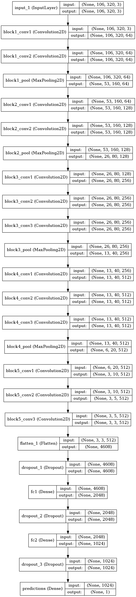

# Behavioral Cloning (aka Imitation learning)

This project was created as an assessment for the [Self-Driving Car Nanodegree](https://www.udacity.com/course/self-driving-car-engineer-nanodegree--nd013) Program by Udacity. 
The goal of the project is to build a system (based on deep convnets in my case) so that the system coudl drive a car autonomously.
The interesting condition is that train data is gather by human driving a car in a simulator.The simulator has two modes. 
* In the "training mode" the car can be controlled through a keyboard or a game pad to generated data. 
* In the "autonomous mode"  the car receives it's input commands by the python script.

The results of the autonomous driving can be seen on animated images below.

Track 1                   |  Track 2
:----------------------------:|:------------------------------:
[](https://youtu.be/Y_ZFA9DfSsA) |[](https://youtu.be/jaxhNCQOzTk)


# Dependencies

This project requires **Python 3.4** and the following Python libraries installed:
- [NumPy](http://www.numpy.org/)
- [SciPy](https://www.scipy.org/)
- [matplotlib](http://matplotlib.org/)
- [pandas](http://pandas.pydata.org/)
- [TensorFlow](http://tensorflow.org)
- [Keras](https://keras.io/)
- [h5py](http://www.h5py.org/)
- [flask-socketio](https://flask-socketio.readthedocs.io/en/latest/)
- [eventlet](http://eventlet.net/)
- [pillow](https://python-pillow.org/)


# HowTo
## Autonomous Driving

The drive script needs the path to the model definition as argument. 
* It must be a json file generated by Keras. 
* Model weights have to be located at the same path 
Script can be executed with the following command:

```
python drive.py model.json
```
The script will automatically connect to the simulator and send commands as soon as it's entering the autonomous mode.

## Retrain the model on the new data

In order to train the model (transfer learn pre-trained vgg16 model) one has to run
```
python3 drive.py model.json
```
It is important to know that there are several configurable parameters that can be configured in config.py
```
BATCH_SIZE
NUM_EPOCH
```
I have selected the batch size of 100 (though sometimes it is recommended to use 128). The number of epochs that was used is only 7. 
I have started experiments from 20, but looking at the loss it looks like 7 is more then enough for stable autonomous driving in the simulated environment
# Network architecture and data processing

## Network architecture
Down to its core this project is an image recognition task and I did not want train the model from scratch. One of the best
available pertained models for image recognition is vgg16. I have used that with a modification to adopt the regression nature of the problem
(top layer is built to be able to predict contentious values instead of classes) The pertained model is automatically downloaded when program is run for the first time during the training phase

**_The model architecture_**
 

I have also tried an architectures based on [comma.ai](https://github.com/commaai/research). It works also but takes longer to train in my case.
Fully trained model can be downloaded here

- [model.json](https://drive.google.com/open?id=0B8Ig8LBgb5IzUDZablVsNmhzbEE)
- [model.h5](https://drive.google.com/open?id=0B8Ig8LBgb5IzcXhVXzRpZ2FFTFU)

It would be extremely intersting to try to do the project with squeeze net (todo for me)


## Data
### Data Collection
In training mode in the simulator, data is collected by recording images through three forward facing cameras. 
The fact that there are three images is very important since it allows to provide more data at the same time for training, and what is 
not less and maybe actually more important is to provide correction steering angel when car heads towards the side of the road. 
This smart data collection hack is mentioned in NVIDIA paper. Looking ahead it is worth mentioning that training on only center image
or on the stitched together image with only one (not adjusted) steering angel leads to much worse results.


| :: | Left          | Center        | Right  |
| :---: | ------------- |:-------------:| ------|
|Image| |  | 
|Angle (rounded)|0.36|	-0.25|-0.100000|

As it is mentioned in the lecture for training data I have recorded data of two types:
##### **Controlled Driving**  
I maintained (or tried to maintain since it is really difficult thing to do with a keyboard) the 
vehicle close to the center of the driving lane as it travelled through the simulator course. 

##### **Recovery Driving**. 
I recorded several episodes starting from the line and going towards center of the road. I have also tried wiggling
on the road, but after several experiments I have removed that data. It is worth mentioning once again that adjusting steering 
angle for side (left and right) cameras is _extremely_ important here to get stabilizing and recovery behaviour. 

### Collected data summary:


 Name                   | Number Images  | Description                                                               
:-----------------------|---------------:|:--------------------------------------------------------------------------
 lap1         |  8.921  | driving almost centered on the track 1                                             
 lap1_reverse |  9.998  | driving opposite direction  on the track 1 
 lap2         |  8.852  | driving on track 2
 lap2_reverse | 19.274  | driving on track 2 in the opposite direction       
 lap1a        | 7.250   | driving from the side of the road      
 **total**              | **54295**     |                                                                           

Used for validation

 Name                   | Number Images  | Description                                                               
:-----------------------|---------------:|:--------------------------------------------------------------------------
 test          |  2.591         | validation ride on track 1                    


## Data Augmentation and Training

Data augmentation is done during the training phase through the modified Keras data generator
[Keras ImageDataGenerator](https://keras.io/preprocessing/image/) . While original Keras generator is doing most of the work I have made specific changes such as mirroring and _negation_ of the given steering angle.
This again is an important thing (see Conclusion section)

Model is trained using adam optimizer. In order to evaluate each epoch validation loss is calculated. The model that is
attached to this repository is trained using 5 epochs.

Using the modified keras image generator, modified data is generated on the fly. Important steps in data augmentation are:
* Affine transform the image
* Change brightness. Brightness is extremely important for successful driving on track 2 due to the high amount of shadows there.
* Use mirroring (with negation of steering angle). Mirroring is important to remove remove training bias in steering angle and make data more balanced.

I have seen on the forums I have seen that students also use creation of artificially shadowed parts of images. 
This might really be useful I have not tried since the model performs well without this.


## 5. Conclusion

A deep convnet model for autonomous driving trained by using a human generate data. 
The model, was able to learn to imitate human behaviour, and was able to generalize response. On the other hand, I would like to note here that behavioral (immitation) learning theoretically does not provide an asymptotically stable dynamical system. This actually can be noted on the presented model: car successfully autonomously drives a lap or several laps, but if i leave the car on the track for a long period of time, from experiment to experiment, depending on some slight fluctuations in the behaviour, in the long run the car can go off road.
It is worth noting that during train data recording I was not using brake at all effectively removing that parameter.
### Notes

Take aways from the project:

1. **Data processing is as important as learning process:** data, data, data.. Data generation, data augmentation is one of the most important things
1. **Model reusage** Training model from scratch takes a lot of time (I tried nvidia one). In order to experiment I had to train model with various minor tweaks many many times.
Using transfer learning and pretrained vgg166 saved a lot of time.

